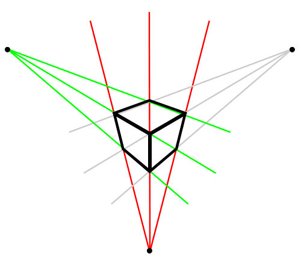

Back in high school, I attended some programming classes that taught basic programming skills, front-end web development, and a little bit of back-end development. One of the first programming languages I ever learned was JavaScript, and it was what got me hooked on programming in general. During my time in high school, I wanted to explore other programming languages such as Python, Java, and C#. As a result, I remember trying to learn C#, but I got confused by the differences in syntax of C# compared to JavaScript. One of the differences is that variables require a data type (e.g. `int`, `char`, etc.) to be specified rather than just using `var` or `let`.

To my younger self, Python, Java, and C# were almost like learning a second language (as in the languages we speak and write with). Eventually, I decided to study the other programming languages as if I never programmed before. What is a variable? What is a function/method? How do you make a loop? These were a handful of questions I asked myself that made me realize that these programming languages, JavaScript included, are not so different. Even if they are written differently, they can be used to more or less achieve the same outcome, like printing out "Hello World!"

Of course, there are still some additional features that may be unique or new to certain languages. For instance, ES6 (ECMAScript), the most recent version of JavaScript, introduces destructuring, which provides a concise way of assigning object properties to variables. I had only learned about it a few days ago, but it would have been useful for making my code look neater. For those who are not familiar with destructuring, here is a brief example of what it is:

```
const OBJECT = {
  name: "foo",
  type: "bar",
  value: 25
};

/*
const name = OBJECT.name;
const type = OBJECT.type;
const value = OBJECT.value;
*/
//The above variables is equivalent to writing the destructuring assignment below

const {name, type, value} = OBJECT;

console.log("My name is " + name + " and my type is " + type + ". I have a value of " + value);
```

Regardless of what is similar or different between languages, I always felt that learning about these nuances has provided new perspectives on how to code. Each language has its own advantages, libraries, and syntax that might make it a better fit for a certain job (e.g. C/C++'s faster code execution, Java's various built-in classes, etc.).
