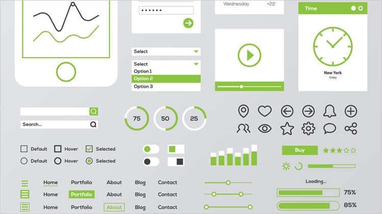
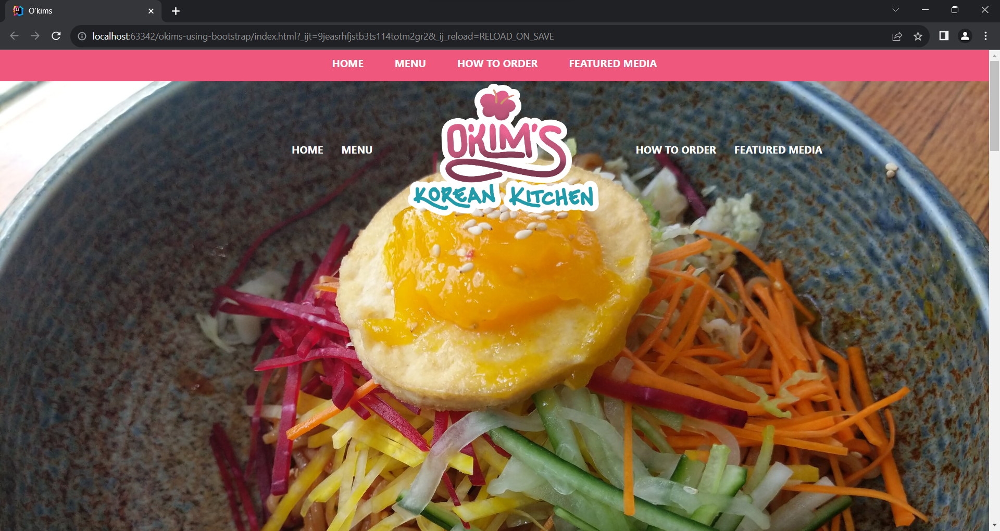
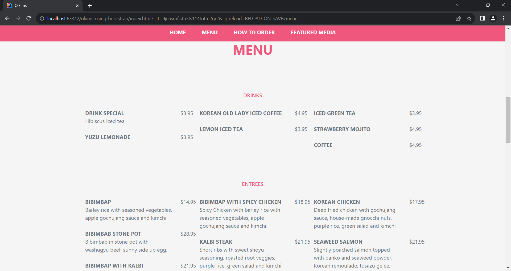
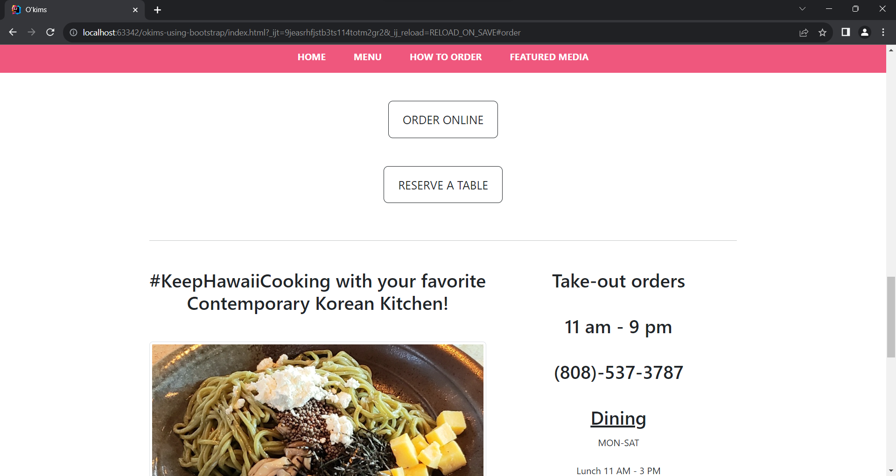

## Introduction

On websites and web applications, people would usually be greeted with a user interface (UI). UIs allow people to see and interact with a given website or application. For instance, a store may have a website that shows what they are selling and provides a way to buy them online. Software engineers are typically responsible for creating UIs when designing a website or web app, but UI design can be tedious and complicated. An important thing to keep in mind with UI design is that there are various browsers (Chrome, FireFox, etc.), OSes (Windows, Linux, etc.), and devices (laptops, phones, and so on). Why is this important? As an example of a reason, a UI may work fine on a computer screen, but it can also be squished and unusable on a phone. To solve this issue, a software engineer could design a UI that adjusts for different screen sizes or create different UIs for each device.

## What is a UI Framework?

A UI framework is a library that features components and utilities for designing a user interface, like buttons, containers, menus, and other things. [Bootstrap](https://getbootstrap.com/), [Metro UI](https://korzh.com/metroui), and [Foundation](https://get.foundation/index.html) are some examples of a UI framework. These frameworks are used to create UIs more quickly and easily through CSS classes. Like in Bootstrap, a [toggle button](https://getbootstrap.com/docs/5.3/components/buttons/#toggle-states) can be made without writing any CSS or JavaScript like so: 

```
<button type="button" class="btn" data-bs-toggle="button">Toggle button</button>
```

Besides faster UI design, some frameworks, such as Bootstrap and Metro UI, are developed "mobile-first." In other words, the framework's components are made with mobile devices in mind, which will adjust accordingly to different screen sizes. This puts less work on software engineers and allows them to focus on designing a creative user interface.

As practice, I made a [simplified recreation](https://github.com/eric-z4/okims-using-bootstrap) of the [O'kim's Korean Kitchen website](https://www.okimshawaii.com/) using Bootstrap. Below are a few screenshots of the bootstrap version of the website.





## The Disadvantages of Using a UI Framework

While UI frameworks can help with UI design, there are limitations to UI customization. In the case of Bootstrap, its [classes for modifying the padding or margin](https://getbootstrap.com/docs/5.3/utilities/spacing/#margin-and-padding) of an element (i.e. `p-1`, `px-2`, `m-3`, etc.) only goes up to a size of 5, which is `3rem`, or 3 times the font size of the root element, by default. To have sizes bigger than `3rem`, you have to make your own CSS class that changes the padding or margin.

Furthermore, a UI framework may not include components that utilize "native" features (i.e. Siri on mobile devices). The framework could still be used to create the general layout of a website or web app, but things like using Siri for voice-controlled interactions must be developed separately.

## Conclusion

