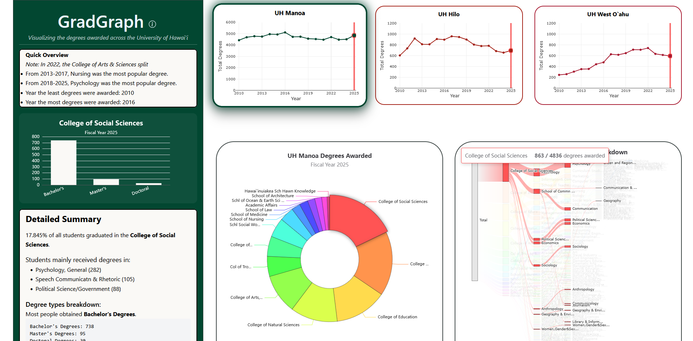

## About

[GradGraph](https://gradgraph.vercel.app/) is a website that visualizes the number of degrees awarded by fiscal year, campus, degree type, and academic group via various charts using [Apache ECharts](https://echarts.apache.org/en/index.html) and [Plotly.js](https://plotly.com/javascript/). The data that was used is a CSV file that is available on [Hawaii Open Data](https://opendata.hawaii.gov/dataset/university-of-hawaii-student-degrees-awarded/resource/3a0b8368-71a7-4402-b9c7-9fc5a398a952), which was filtered to focus on three UH campuses: UH Manoa, UH West O`ahu and UH Hilo. This website was created in collaboration with Adam Graham and Jaren Pinera as a project assignment for ICS 484. I was responsible for the sankey diagram, the website layout, and some of the CSS styling. 

## Experience

This was my first time using several different tools and libraries. Other than Apache ECharts and Plotly, I used [Next.js](https://nextjs.org/) as the framework for the website and deployed it on [Vercel](https://vercel.com/docs). Additionally, I also used [d3js](https://d3js.org/) to parse the CSV and generate the colors seen on the sankey. 

Source: <a href="https://github.com/eric-z4/gradgraph"><i class="large github icon "></i>eric-z4/gradgraph</a>
