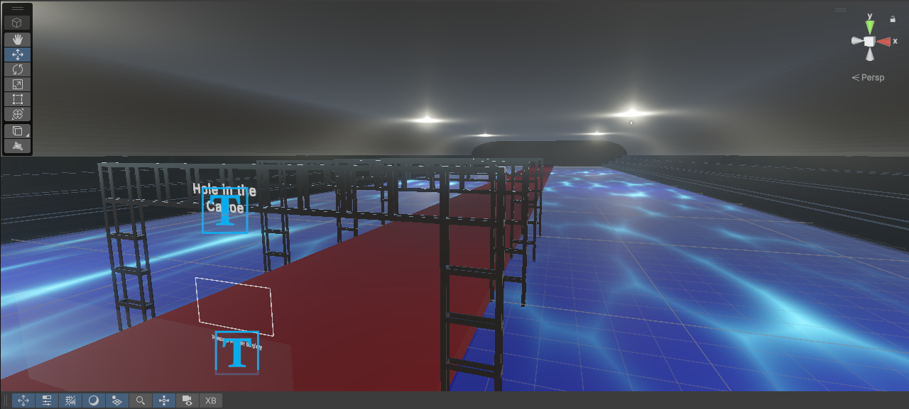
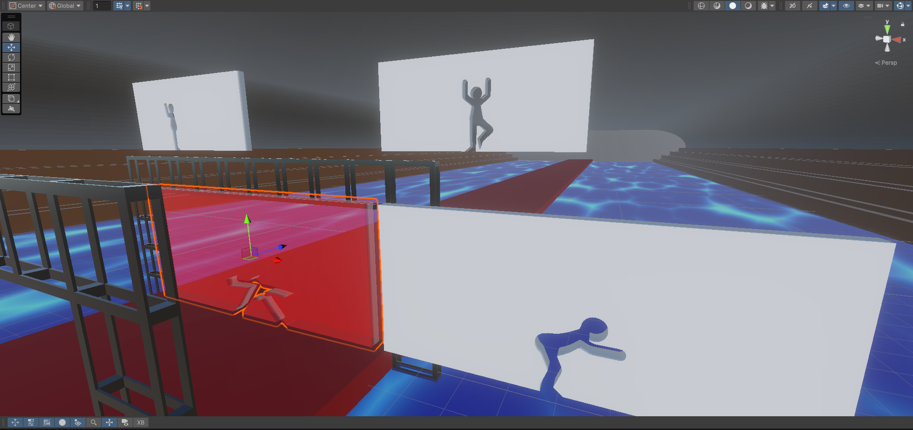

	

		

			
		

		

			  
		

	

## About

Hole in the Canoe is a game that I worked on with Aaron McLean and Rachel Tojio. This was an ICS 486 project assignment to make something for the [CyberCANOE](https://cse.uhh.hawaii.edu/data_visualization/) that was built in the renovated Keller 103 room. The CyberCANOE is an acronym for "Cyber Enabled Collaboration Analysis Navigation and Observation Environment." It is a display technology, developed by Jason Leigh and the [LAVA lab](https://www.lavaflow.info/about), to enable people from different disciplines and campuses to collaborate on projects. The latest CyberCANOE is a single, large, ultra-resolution LED screen that features stereoscopic 3D.

See below for a video of Hole in the Canoe and the CyberCANOE itself:

<video width="960" height="540" controls>
	<source src="HoleInTheCanoe_Video.mp4" type="video/mp4">
</video>

In this [Unity](https://unity.com/products/unity-engine#engine-faq) project, I was responsible for setting up the wall movement, wall spawner, score system, player projection, music & sound effects (found on [Freesound](https://freesound.org/) and [OpenGameArt](https://opengameart.org/art-search-advanced?keys=&field_art_type_tid%5B%5D=12&sort_by=count&sort_order=DESC)), and collision behavior. The [CC project template](https://github.com/doctorspiffy/CC_CANOE/blob/main/CCinstructions2025-09-09.pdf) was used as a base, and to allow the project to utilize the stereoscopic 3D of the CyberCANOE. Vive tracking was eventually implemented to the CC project by Christian Siador, who is a graduate research assistant in the LAVA lab.

## Experience

