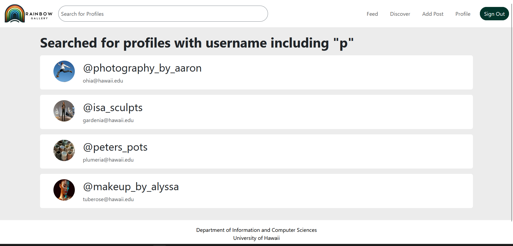

  
  
  

## About

This was a final project for ICS 314, which I worked on with three other group members: Sienne Rodwell, Tatum Umiamaka, and Kobe Uyeda. The goal for this [Meteor](https://www.meteor.com/) web application was to provide a space for UH students to share and look at other students' artworks, photographs, sculptures, textiles, etc. I worked on some parts of the web app, such as the profile search bar, trash post button, and login/signup pages. Other pages that this web app features are an about page, discover page, profile page, and photo interact page that other group members worked on. For more information, see the [project home page for Rainbow Gallery](https://rainbows-gallery.github.io/)

## Experience

This was my first time developing a web application as a group. I learned quite a bit about using Github for project management, such as using Github Project to keep track of tasks to do, working in different branches, and dealing with merge conflicts. Whether by myself or in a team, I can utilize project management in future projects to keep track of progress and identify where errors occur. In addition, I learned more about the frameworks for this web app, which include [Meteor](https://www.meteor.com/) and [React-Bootstrap](https://react-bootstrap.netlify.app/). For instance, the search bar I designed uses a [Form](https://react-bootstrap.netlify.app/docs/forms/overview) with a text field and a hidden submit button when enter is pressed. When a text input is submitted, the data is passed to a search results page that shows any profiles whose username includes the text input (i.e. an input of `"f"` will look for all profiles with a username that has an `"f"` in it).

Source: <a href="https://github.com/rainbows-gallery/gallery-app"><i class="large github icon "></i>rainbows-gallery/gallery-app</a>
