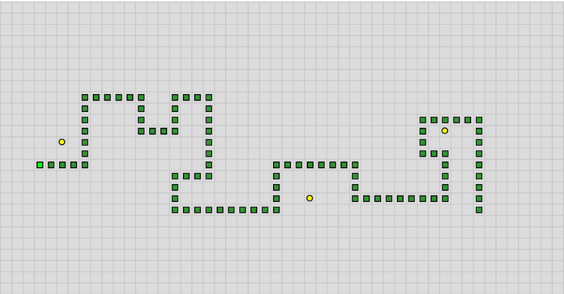

## About

This was a personal project that I created in 2019 (along with the racing game) to experiment with [p5js](https://p5js.org/), a Javascript library that includes various creative tools, and to practice programming in Javascript. The game involves a snake (the green boxes) that never stops moving. As the snake, the player must navigate around the grid to collect food (the yellow boxes) and avoid crashing into a wall or their body. The grid is fairly big, so the player 

## Experience
