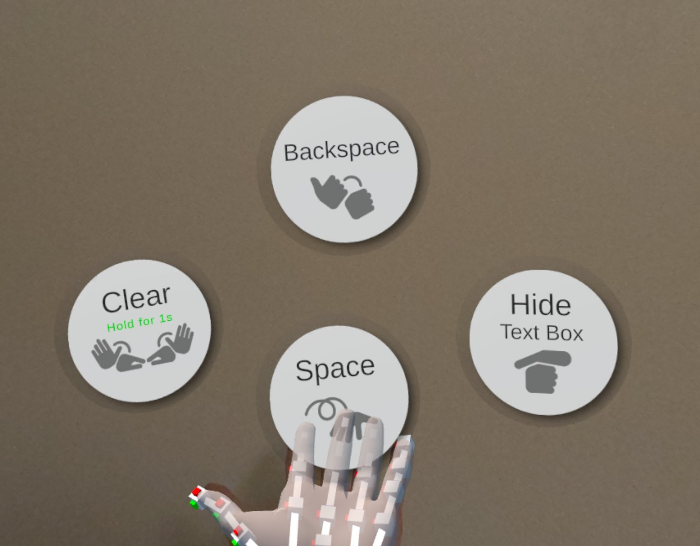
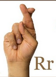
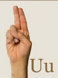
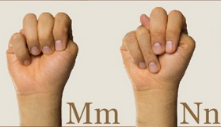

<video width="960" height="540" controls>
	<source src="Talking_Hands_Shortened.mp4" type="video/mp4">
</video>

[Full video can be viewed here](https://drive.google.com/file/d/16PxnjfINgCe_5EiXlzUUTgPrcdIOvbtl/view?usp=drive_link)

## About

Talking Hands is a augmented reality app prototype that allows the user to type using the American sign language (ASL) alphabet. Aaron McLean, Rachel Tojio, and I worked on this project for a ICS 486 XR/AR assignment using [Meta XR SDKs for Unity](https://developers.meta.com/horizon/documentation/unity/unity-sdks-overview/) and the Meta Quest 3/3S. The project also included the [XR Hands package](https://docs.unity3d.com/Packages/com.unity.xr.hands@1.4/manual/index.html), which provided the hand model, the hand joint tracker (the UI with the bars), and the ability to trigger events via hand gestures. Using XR Hands, I created the gestures for most of the alphabet (except for J and Z) and made them write their letter to the text box in front of the user. In addition, I implemented the "palm up" menu for deleting letters or adding a space.

	

The limited hand tracking of the Quest 3/3S made it difficult to implement certain letters in the ASL alphabet, such as R, U, M, and N. The headset could not track the crossed fingers for R, which made it seem like a U. This was resolved by having a collider appear behind the hand to let the user clarify which letter they are signing (see video below). The headset also could not track fingers that were obscured by the hand, especially for M and N. My group and I thought of tweaking the gestures to something that can be tracked more reliably and still be recognized as M or N. We decided to use the old signs for M and N instead, which was marginally better for tracking.

	
	  
	  

<video width="960" height="540" controls>
	<source src="Testing_R_and_U.mp4" type="video/mp4">
</video>

## Experience

